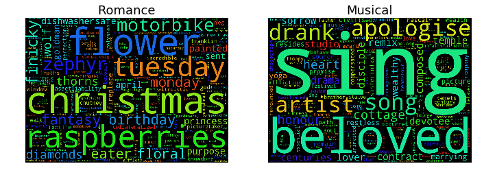

	

    	
    

<h1> IMDb Network and Text Analysis </h1>
<h3> By Thomas Sandfeld Nielsen & Lennart Pedersen </h3>

See our explainer notebook [here](http://nbviewer.jupyter.org/github/TSandfeld/02805_imdb.github.io/blob/gh-pages/Assignment%20B.ipynb).

## Introduction
IMDb is the world's biggest online movie database, launched back in 1990. According to Wikipedia[^wiki] IMDb contains more than 3.9 million movie/tv-show titles and 7.4 million personalities. With this data we will try to uncover some patterns and relationships between the best critically acclaimed and highest grossing movies of all time. We will use techniques from the world of network-, text- and data analysis to accomplish this.
Although IMDb has millions of titles for us to play around with we don't have the computing power/time to go through all that data. So instead we are going to use a little less data - just under 5000 titles with all the relevant attributes such as cast, director, year, budget, domestic gross, genres, etc. We also gathered ~1200 moviescripts for text analysis, so we can look at patterns within those. The movies are from different decades, but they are mainly from the late 90's to recent years.

Should you be interested in working with our datasets, then please see the [Download Dataset](#download-sets) section in the end.

## Network analysis
Let's begin exploring our datasets .. 

### IMDb Rating
One important feature of IMDb's database is the **IMDb rating**, which is a numeric scale from 1-10 used to judge the quality of the movie. The higher the rating, the better the movie and all ratings are generated from voting by registered users of the site. 

As we mentioned we have the IMDb rating in our dataset, so we can see the distribution of the IMDb ratings and see that they are uniformally distributed. The average of all the IMDb ratings is 6.3. 

Most people would preferrably watch movies with rating of 7 or above. As many people check the rating af a movie before they decide to watch it, the IMDb rating actually has quite some influence as to what movies are watched and which that are not. The ratings are regulated through the votes by numerous different users, and eventhough you don't know who actually voted the movie, the number of voters usually make the rating quite trustworthy as well as balance the rating.

Lets look a some more data ... as anyone could go to IMDb's website and look up the individual movie ratings, it would be more interesting how the actors are rated.
For all the movies an actor/actress has been part of, we will average their rating and plot it. We will restrict the plot to the 10 best and 10 worst actors who's been part of more than 10 movies. This gives us the following, where we can see some familiar names.

So it seems that some actors actually receive great ratings througout a lot of movies. Choosing the high-rated actors for a movie will therefore probably give your movie a good rating. We will discuss this topic in depth later on where we compare the director fo the movie with the actors to see if similarities on their rating appear.

Of course this does reflect the rating of the movie as a whole more than the individual actor's performance in it. But it would not be unfair to assume that a movie's rating depends on the performance of the lead actor/actress - so the ratings are usable.

A key attribute to a successfull movie is of course how much money it makes. Some would say this is the main reason for why some movies are produced. One hypothesis could be that the better rated a movie is, the more money it must have brought in, because who doesn't want to watch a good movie? So let's see if there's is a relation between the rating and gross of a movie.

There is a *small* correlation here. No movie grossing more than 400 mil. $ has a rating less than 6, which is average. However a lot of movies has grossed less than 100 million dollars and gained ratings above 8. This could have to do with the fact that the gross is *domestic* and not international. So if a very good movie is produced in a "small" country it may not have grossed as much as it would've in America for example.

### Genres
There's a lot of different genres in the movie world and there's bound to be some interesting connections to the films. First let's see how the most appreciated genres of movie world compares to how much the genres gross worldwide.

From comparing the two plots we can make some interesting discoveries. E.g. Film-noir which has the highest average IMDb score is actually the film genre with the lowest gross. To get a clearer view on whether there is a correlation between the gross and rating we have plotted the average rating versus the average gross for each genre in a scatter plot and with a linear fit.

The correlation coefficient for the two averages is actually -0.523.
So if you want to earn millions of dollars you should not expect to also receive a high IMDb rating. This a bit surprising and tells us that the correlation between a movie's rating and its' gross is actually negative. The IMDb rating is thereby not the only indicator as to whether your movie is successful or not. 

This gives a rather unusual result as the best rated genre is the genre that is least profitable! But in the case of our dataset this is probably just an anomaly as it doesn't make sense that whole genre of Film-Noir hasn't grossed a single dollar.

### Movie connections
Let's now look at how all these movies actually are connected. We have created a network of movies where two movies are connected if one or more actors appear in the both movies. By plotting the network we get what is shown as a graph below.

If we extract only the movies in the big cluster in middle of this graph, we can eliminate the movies that have no connection with all other movies. Now the graph looks like this.

As we can see from this graph, most movies are clustered around the middle of the graph which tells us that a large amount of the movies in this network are highly connected. Thus many movies have some of the same actors, and only a small amount of movies connect to few other movies, meaning that the actors in those movies do not appear in other movies. This could be due to the fact that some movies have only few actors and that those are relatively unknown or perhaps chosen specifically for one movie.

Analysing this network, we see that the distribution of degrees (number of movies one movie is connected to) follows a powerlaw. Therefore we can conclude that our network is scale free. Hence our network consist of a few movies with a lot of connections, so-called **hubs**, and then most of the movies having few connections.
Here the distribution is plotted on a log-scale.

### Communities
To identify communities in this network we have used the Louvain community detection algorithm which identifies communities in a graph, communities being movies that are all closely connected with each other but not so much with other communities. This algorithm found 13 communties in our network. One interesting aspect of this is to discover whether these communties actually correspond to the genres of the movies. We have plotted how much one community consists of the same genre.

Comment on findings in the above.

Director/Actor rating - correlation

High positive linear correlation! - some due to the fact that the actors obviously are in some of the same movies as the directors. 

There is only a small positive linear correlation between the duration of a movie and its rating. No real tendency but longer movies have a small advantage..

## Text analysis of manuscripts

### Term Frequency
We've looked quite a bit on how different attributes relate in our network of movies/actors. Let's now look at some manuscripts. 
Using a technique called Term Frequency - Inverse Document Frequency, or TF-IDF, we can figure how important a word in a script is for our total collection of scripts. So by doing this we can find the words that are most important for each genre of movies in our dataset.

For the different genres the words seem to fit in pretty well.

As mentioned in the introduction, we have about ~1200 scripts and ~5000 movies in our dataset. This means that we don't have a manuscript for each movie in our dataset, which leads to a margin of error in the above wordclouds. For example, raspberries may not be as important a term in the whole genre of romance films, as it is for the genre in our dataset.

### Sentiment
Let us look at the sentiment of the scripts we have. Using the LabMT wordlist[^labmt], which provides a sentiment score for a lot of english words, we can figure out how positive/negative a script is. A low score like 5000 is pretty negative for a movie script, while a score like 100,000 i a very positive script.

Having calculated the sentiment of the scripts we can see if it relates in any way to the success of a movie. For example, let's see if there is a connection between the sentiment and the IMDb rating of a movie ..  

On the plot we can see that there is *very little*, if any, correlation between a movie's IMDb rating and the sentiment of the movie's script. This does make sense as a lot of very well liked movies are drama and action movie's which tend to be more intense in the language than other movies.

### Do a movie gross vs sentiment *here* or not - der er kun omkring 600 film der passer til scripts og penge dict'en og den plottet viser ikke så meget. Corcoeff på 0.171.

Instead of only looking at movies let's look at actors. Some actor's are more featured in one genre than others, so let's see if there is a relation between a actors sentiment and their IMDb rating. We will calculate the actor's sentiment as an average of the sentiments of the scripts for the movies he has been in. We will be looking at actors who has been in more than 5 movie's, so there is some data to work with. 

One this bar graph we see some familiar names, who we might associate with being good actors, suchs as Robert De Niro and Joseph Gordon-Levitt.

If we correlate their sentiment to their IMDb rating we get this:

Again, it does not seem that the sentiment of the scripts has much to do with the rating of the actor.

##  Download Datasets
So our dataset mainly comprises of a dataset from [kaggle.com](https://www.kaggle.com/deepmatrix/imdb-5000-movie-dataset)

## References

[^wiki]: Wikipedia about IMDb: [https://en.wikipedia.org/wiki/IMDb](https://en.wikipedia.org/wiki/IMDb)

[^labmt]: Wordlist article: [http://journals.plos.org/plosone/article?id=10.1371/journal.pone.0026752](http://journals.plos.org/plosone/article?id=10.1371/journal.pone.0026752)