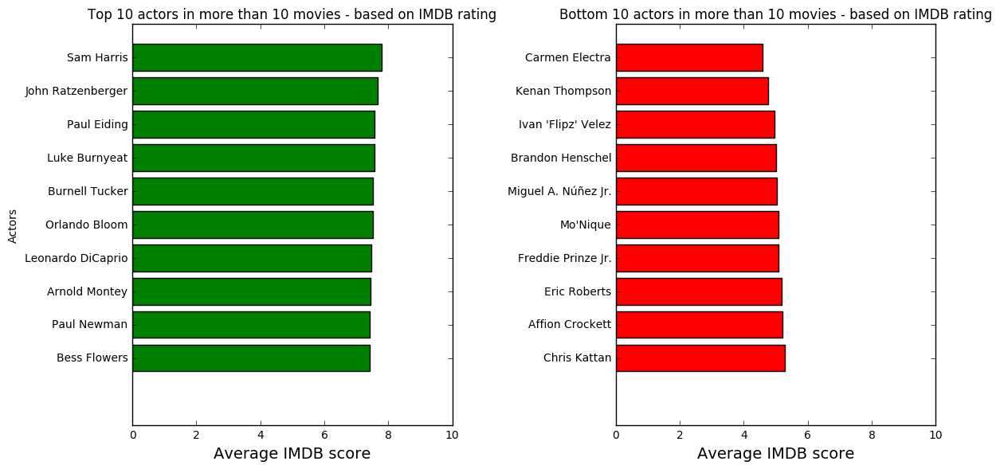

	

    	
    

<h1> IMDb Network and Text Analysis </h1>
<h3> By Thomas Sandfeld Nielsen & Lennart Pedersen </h3>

See our explainer notebook [here](http://nbviewer.jupyter.org/github/TSandfeld/02805_imdb.github.io/blob/gh-pages/Assignment%20B.ipynb).

## Introduction
IMDb is the worlds biggest online movie database, launched back in 1990. According to Wikipedia[^wiki] IMDb contains more than 3.9 million movie/tv-show titles and 7.4 million personalities. With this data we will try to uncover some patterns and relationships between the best critically acclaimed and highest grossing movies of all time. We will use techniques from the world of network-, text- and data analysis to accomplish this.
Although IMDb has millions of titles for us to play around with we don't have the computing power/time to go through all that data. So instead we are going to use a little less data - just under 5000 titles with all the relevant attributes such as cast, director, year, budget, domestic gross, genres, etc. We also gathered ~1200 moviescripts for text analysis - keep reading for more. 

Should you be interested in working with our datasets, then please see the see [Download Dataset](#download-sets) in the end.

## Network analysis
Let's explore our datasets .. 

One aspect of IMDb is the **IMDb Rating** which is a numeric scale from 1-10 used to judge the quality of the movie. The higher the rating, the better the movie.
All ratings are generated from voting by registered users of the site. 

As we can see from the distribution of the IMDb ratings they are uniformally distributed. The average IMDb score is 6.3. 

Most people would preferrably watch movies with rating of 7 or above. As many people check the rating af a movie before they decide to watch it, the IMDb rating actually has quite some influence as to what movies are watched and which that are not. The ratings are regulated through the votes by numerous different users, and eventhough you don't know who actually voted the movie, the number of voters usually make the rating quite trustworthy as well as balance the rating.

However, anyone could go to IMDb's website and look up the individual movieratings, so let's instead see how the actors are rated.
For all the movies an actor/actress has been part of, we will average their rating and plot it. We will restrict the plot to the 10 best and 10 worst actors who's been part of more than 10 movies. This gives us the following, where we can see some familiar names.

So it seems that some actors actually receive great ratings througout a lot of movies. Choosing the high-rated actors for a movie will therefore probably give your movie a good rating. We will discuss this topic in depth later on where we compare the director fo the movie with the actors to see if similarities on their rating appear.

A key attribute to a successfull movie is of course how much money it makes. So let's first compare the most appreciated genres of films to how much the genres gross worldwide.

From comparing the two plots we can make some interesting discoveries. E.g. Film-noir which has the highest average IMDb score is actually the film genre with the lowest gross. To see whether there is a correlation between the gross and rating we have plotted the average rating versus the average gross for each genre in a scatter plot and with a linear fit.

The correlation coefficient for the two averages is actually -0.523.
So if you want to earn millions of dollars you should not expect to also receive a high IMDb rating. This a bit surprising and tells us that the correlation between a movie's rating and its' gross is actually negative. The IMDb rating is thereby not the only indicator as to whether your movie is successful or not. 

Let's look at how all these movies actually are connected. We have created a network of movies that are connected if any actor appears in both. The network is shown as a graph below.

If we extract only the movies in the big cluster in middle of this graph, we can eliminate the movies that have no connection with all other movies. Now the graph looks like this.

As we can see from this graph, most movies are clustered around the middle of the graph which tells us that a large amount of the movies in this network are highly connected. Thus many movies have some of the same actors, and only a small amount of movies connect to few other movies, meaning that the actors in those movies do not appear in other movies. This could be due to the fact that some movies have only few actors and that those are relatively unknown or perhaps chosen specifically for one movie.

Analysis this network we see that the distribution of degrees(number of movies on movie is connected to) follows a powerlaw. Therefore we can conclude that our network is scale free. Hence our network consist of a few movies with a lot of connections, so-called **hubs**, and then most of the movies having few connections.
Here the distribution is plotted on a log-scale.

To identify communities in this network we have used the Louvain community detection algorithm which identifies communities in a graph, communities being movies that are all closely connected with each other but not so much with other communities. This algorithm found 13 communties in our network. One interesting aspect of this is to discover whether these communties actually correspond to the genres of the movies. We have plotted how much one community consists of the same genre.

Comment on findings in the above.

Gross/rating

Director/Actor rating - correlation

High positive linear correlation! - some due to the fact that the actors obviously are in some of the same movies as the directors. 

There is only a small positive linear correlation between the duration of a movie and its rating. No real tendency but longer movies have a small advantage..

Actor network
...

## Text analysis

##  Download Datasets
So our dataset mainly comprises of a dataset from [kaggle.com](https://www.kaggle.com/deepmatrix/imdb-5000-movie-dataset)

## References

[^wiki]: Wikipedia about IMDb: [https://en.wikipedia.org/wiki/IMDb](https://en.wikipedia.org/wiki/IMDb)